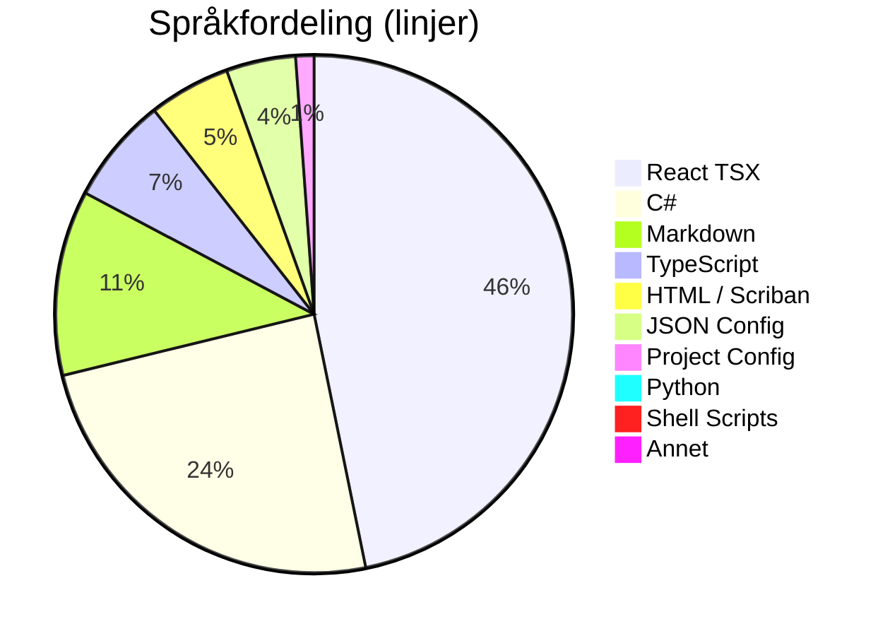
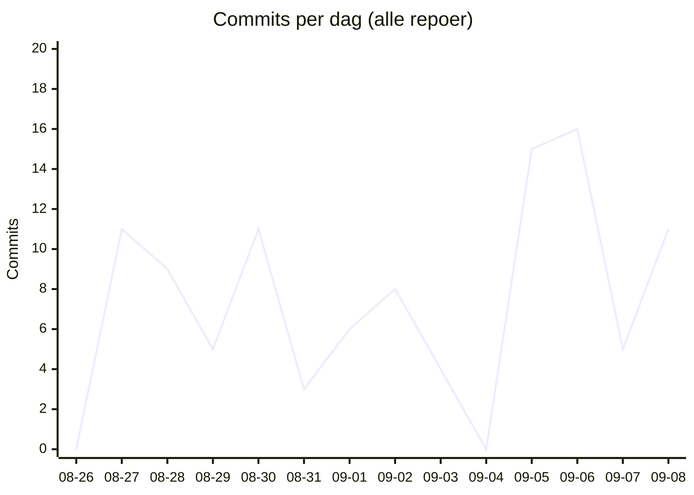

# 📊 Kodelinje-status for Kjøkkenhylla
**Dato:** 2026-09-08 21:47:46  
**Målt 1 av siste 7 dager** 🔥

## 📉 Utvikling over tid
## 🏷️ Overordnet Fordeling
| Hovedkategori | Filer | Innhold/Linjer | Kommentarer | Blank | Totalt |
| :--- | :---: | :---: | :---: | :---: | :---: |
| **Ren Kode** | 438 | 23850 | 668 | 3500 | 28018 |
| **Konfigurasjon** | 48 | 1756 | 70 | 97 | 1923 |
| **Dokumentasjon** | 41 | 3267 | 0 | 1407 | 4674 |

## 📁 Fordeling per Mikrotjeneste / Prosjekt
| Prosjekt / Mappe | Filer | Ren Kode | Konfigurasjon | Dokumentasjon | Kommentarer | Totalt | Trend |
| :--- | :---: | :---: | :---: | :---: | :---: | :---: | :--- |
| `recipe-auth-api` | 158 | 4706 | 751 | 212 | 164 | 7067 | - |
| `recipe-core-api` | 21 | 183 | 154 | 50 | 0 | 469 | - |
| `recipe-gateway-api` | 15 | 167 | 280 | 67 | 24 | 613 | - |
| `recipe-infrastructure` | 31 | 420 | 150 | 1859 | 112 | 3418 | - |
| `recipe-notification-service` | 129 | 3240 | 211 | 483 | 175 | 4951 | - |
| `recipe-scraper-service` | 13 | 37 | 131 | 67 | 0 | 290 | - |
| `recipe-webapp` | 160 | 15097 | 79 | 529 | 263 | 17807 | - |
| **TOTALT** | **527** | **23850** | **1756** | **3267** | **738** | **34615** | |

## 💻 Fordeling per Språk / Filtype
| Språk / Filtype | Kategori | Filer | Linjer | Kommentarer | Blank | Totalt |
| :--- | :--- | :---: | :---: | :---: | :---: | :---: |
| **React TSX** | Ren Kode | 73 | 13218 | 161 | 1232 | 14611 |
| **C#** | Ren Kode | 267 | 6891 | 194 | 1564 | 8649 |
| **Markdown** | Dokumentasjon | 41 | 3267 | 0 | 1407 | 4674 |
| **TypeScript** | Ren Kode | 74 | 1879 | 102 | 312 | 2293 |
| **HTML / Scriban** | Ren Kode | 18 | 1442 | 153 | 282 | 1877 |
| **JSON Config** | Konfigurasjon | 19 | 1226 | 0 | 0 | 1226 |
| **Project Config** | Konfigurasjon | 22 | 323 | 0 | 74 | 397 |
| **Python** | Ren Kode | 1 | 270 | 40 | 70 | 380 |
| **Shell Scripts** | Ren Kode | 3 | 144 | 18 | 40 | 202 |
| **YAML Config** | Konfigurasjon | 2 | 128 | 20 | 8 | 156 |
| **Environment Config** | Konfigurasjon | 3 | 40 | 36 | 10 | 86 |
| **Docker Config** | Konfigurasjon | 2 | 39 | 14 | 5 | 58 |
| **SQL Scripts** | Ren Kode | 2 | 6 | 0 | 0 | 6 |

## 🔥 Commit-aktivitet (siste 14 dager, alle repoer)
`▁▅▄▃▅▂▃▄▂▁▇█▃▅`  (104 commits totalt)

