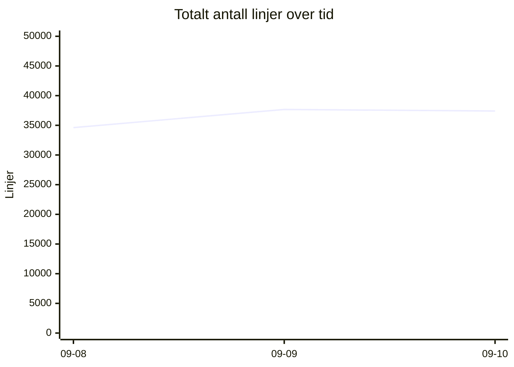
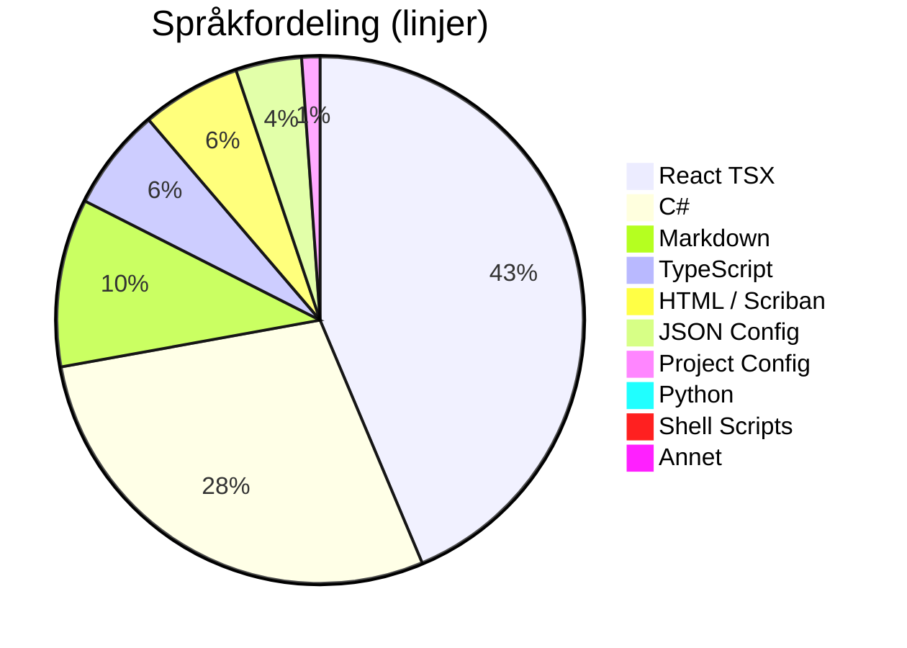
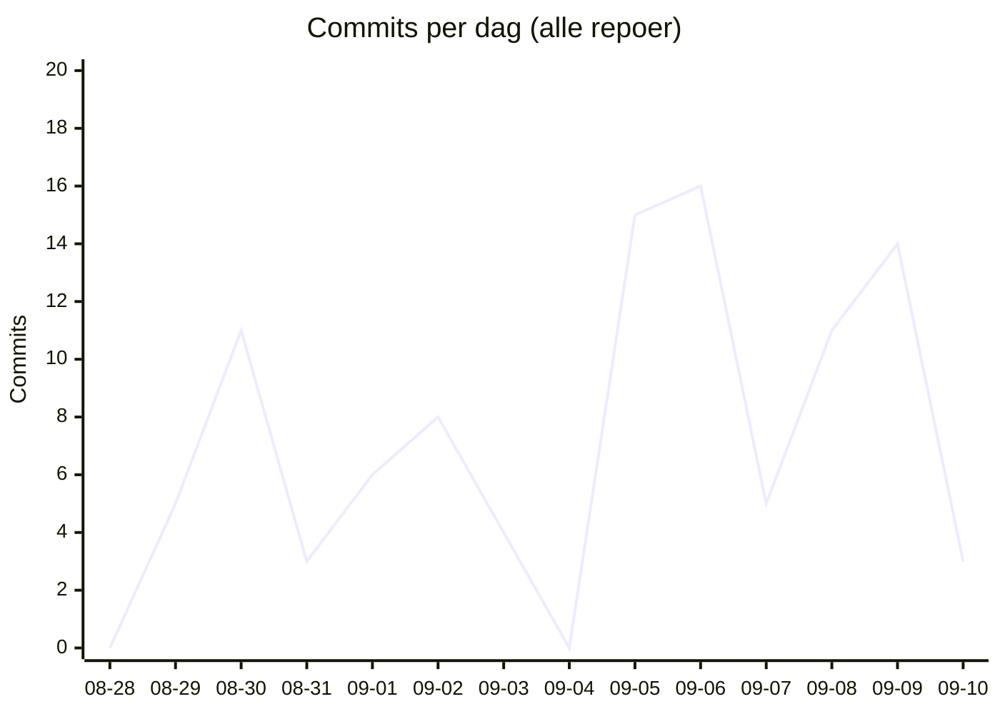

# 📊 Kodelinje-status for Kjøkkenhylla
**Dato:** 2026-09-10 20:59:38  
**Målt 3 av siste 7 dager** 🔥

### 📈 Endring siden forrige måling
* **Filer:** 573 (+2)
* **Ren Kode:** 26128 (+0)
* **Konfigurasjon:** 1778 (+17)
* **Dokumentasjon:** 3135 (-272)
* **Kommentarer:** 877 (+0)
* **Totalt (inkl. blanke):** 37414 (-257)

## 📉 Utvikling over tid
`▁█▇`  (34615 → 37414)

## 🏷️ Overordnet Fordeling
| Hovedkategori | Filer | Innhold/Linjer | Kommentarer | Blank | Totalt |
| :--- | :---: | :---: | :---: | :---: | :---: |
| **Ren Kode** | 478 | 26128 | 807 | 3913 | 30848 |
| **Konfigurasjon** | 49 | 1778 | 70 | 101 | 1949 |
| **Dokumentasjon** | 46 | 3135 | 0 | 1482 | 4617 |

## 📁 Fordeling per Mikrotjeneste / Prosjekt
| Prosjekt / Mappe | Filer | Ren Kode | Konfigurasjon | Dokumentasjon | Kommentarer | Totalt | Trend |
| :--- | :---: | :---: | :---: | :---: | :---: | :---: | :--- |
| `recipe-auth-api` | 169 | 4832 | 772 | 540 | 159 | 7755 | ▁▂█ |
| `recipe-core-api` | 21 | 183 | 154 | 50 | 0 | 469 | ▄▄▄ |
| `recipe-gateway-api` | 15 | 167 | 280 | 67 | 24 | 613 | ▄▄▄ |
| `recipe-infrastructure` | 31 | 420 | 150 | 1435 | 112 | 2913 | ▅█▁ |
| `recipe-notification-service` | 166 | 5302 | 212 | 521 | 320 | 7597 | ▁██ |
| `recipe-scraper-service` | 13 | 37 | 131 | 67 | 0 | 290 | ▄▄▄ |
| `recipe-webapp` | 158 | 15187 | 79 | 455 | 262 | 17777 | █▁▁ |
| **TOTALT** | **573** | **26128** | **1778** | **3135** | **877** | **37414** | |

## 💻 Fordeling per Språk / Filtype
| Språk / Filtype | Kategori | Filer | Linjer | Kommentarer | Blank | Totalt |
| :--- | :--- | :---: | :---: | :---: | :---: | :---: |
| **React TSX** | Ren Kode | 73 | 13279 | 161 | 1239 | 14679 |
| **C#** | Ren Kode | 305 | 8666 | 316 | 1929 | 10911 |
| **Markdown** | Dokumentasjon | 46 | 3135 | 0 | 1482 | 4617 |
| **TypeScript** | Ren Kode | 74 | 1908 | 101 | 319 | 2328 |
| **HTML / Scriban** | Ren Kode | 20 | 1855 | 171 | 316 | 2342 |
| **JSON Config** | Konfigurasjon | 19 | 1230 | 0 | 0 | 1230 |
| **Project Config** | Konfigurasjon | 23 | 341 | 0 | 78 | 419 |
| **Python** | Ren Kode | 1 | 270 | 40 | 70 | 380 |
| **Shell Scripts** | Ren Kode | 3 | 144 | 18 | 40 | 202 |
| **YAML Config** | Konfigurasjon | 2 | 128 | 20 | 8 | 156 |
| **Environment Config** | Konfigurasjon | 3 | 40 | 36 | 10 | 86 |
| **Docker Config** | Konfigurasjon | 2 | 39 | 14 | 5 | 58 |
| **SQL Scripts** | Ren Kode | 2 | 6 | 0 | 0 | 6 |

## 🔥 Commit-aktivitet (siste 14 dager, alle repoer)
`▁▃▅▂▃▄▂▁▇█▃▅▇▂`  (101 commits totalt)

