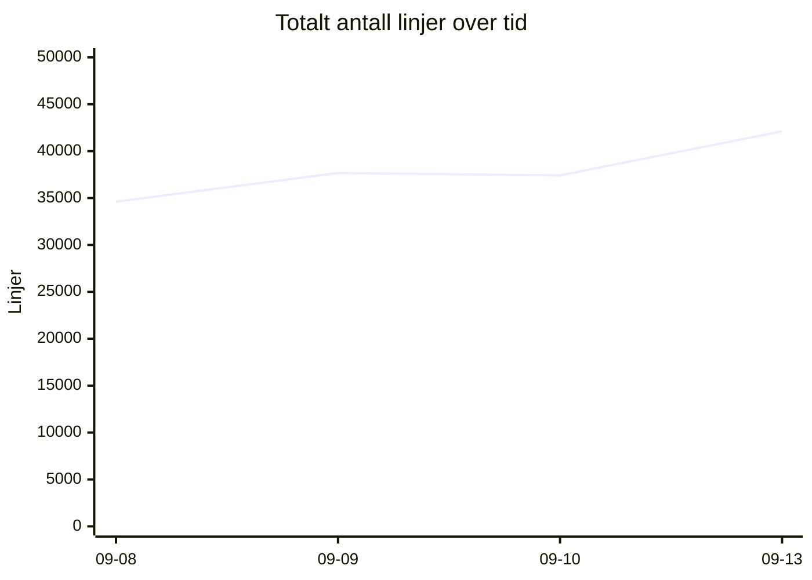
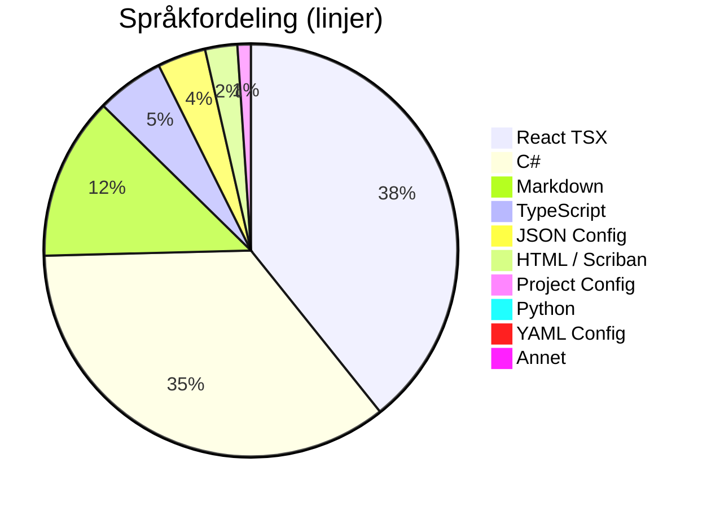
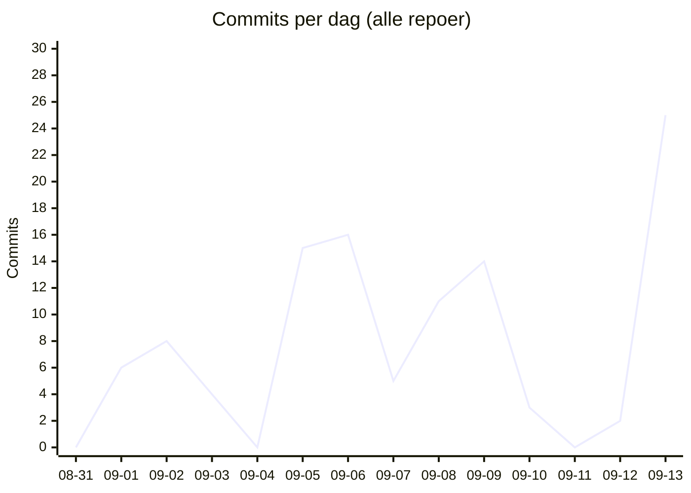

# 📊 Kodelinje-status for Kjøkkenhylla
**Dato:** 2026-09-13 19:31:36  
**Målt 4 av siste 7 dager** 🔥

### 📈 Endring siden forrige måling
* **Filer:** 634 (+61)
* **Ren Kode:** 28286 (+2158)
* **Konfigurasjon:** 1970 (+192)
* **Dokumentasjon:** 4313 (+1178)
* **Kommentarer:** 1050 (+173)
* **Totalt (inkl. blanke):** 42110 (+4696)

## 📉 Utvikling over tid
`▁▃▃█`  (34615 → 42110)

## 🏷️ Overordnet Fordeling
| Hovedkategori | Filer | Innhold/Linjer | Kommentarer | Blank | Totalt |
| :--- | :---: | :---: | :---: | :---: | :---: |
| **Ren Kode** | 514 | 28286 | 945 | 4552 | 33783 |
| **Konfigurasjon** | 59 | 1970 | 105 | 117 | 2192 |
| **Dokumentasjon** | 61 | 4313 | 0 | 1822 | 6135 |

## 📁 Fordeling per Mikrotjeneste / Prosjekt
| Prosjekt / Mappe | Filer | Ren Kode | Konfigurasjon | Dokumentasjon | Kommentarer | Totalt | Trend |
| :--- | :---: | :---: | :---: | :---: | :---: | :---: | :--- |
| `recipe-auth-api` | 212 | 6910 | 867 | 671 | 283 | 10914 | ▁▁▂█ |
| `recipe-core-api` | 21 | 183 | 154 | 50 | 0 | 469 | ▄▄▄▄ |
| `recipe-gateway-api` | 21 | 251 | 312 | 220 | 30 | 987 | ▁▁▁█ |
| `recipe-infrastructure` | 32 | 420 | 150 | 1477 | 112 | 2959 | ▅█▁▁ |
| `recipe-notification-service` | 176 | 5416 | 269 | 685 | 323 | 7961 | ▁▇▇█ |
| `recipe-scraper-service` | 13 | 37 | 131 | 67 | 0 | 290 | ▄▄▄▄ |
| `recipe-webapp` | 159 | 15069 | 87 | 1143 | 302 | 18530 | ▁▁▁█ |
| **TOTALT** | **634** | **28286** | **1970** | **4313** | **1050** | **42110** | |

## 💻 Fordeling per Språk / Filtype
| Språk / Filtype | Kategori | Filer | Linjer | Kommentarer | Blank | Totalt |
| :--- | :--- | :---: | :---: | :---: | :---: | :---: |
| **React TSX** | Ren Kode | 72 | 13276 | 201 | 1237 | 14714 |
| **C#** | Ren Kode | 345 | 11946 | 546 | 2760 | 15252 |
| **Markdown** | Dokumentasjon | 61 | 4313 | 0 | 1822 | 6135 |
| **TypeScript** | Ren Kode | 69 | 1793 | 101 | 316 | 2210 |
| **JSON Config** | Konfigurasjon | 21 | 1277 | 0 | 0 | 1277 |
| **HTML / Scriban** | Ren Kode | 22 | 851 | 39 | 129 | 1019 |
| **Project Config** | Konfigurasjon | 23 | 355 | 0 | 82 | 437 |
| **Python** | Ren Kode | 1 | 270 | 40 | 70 | 380 |
| **YAML Config** | Konfigurasjon | 4 | 172 | 24 | 10 | 206 |
| **Shell Scripts** | Ren Kode | 3 | 144 | 18 | 40 | 202 |
| **Docker Config** | Konfigurasjon | 6 | 121 | 45 | 15 | 181 |
| **Environment Config** | Konfigurasjon | 5 | 45 | 36 | 10 | 91 |
| **SQL Scripts** | Ren Kode | 2 | 6 | 0 | 0 | 6 |

## 🔥 Commit-aktivitet (siste 14 dager, alle repoer)
`▁▂▃▂▁▅▅▂▄▄▁▁▁█`  (109 commits totalt)

