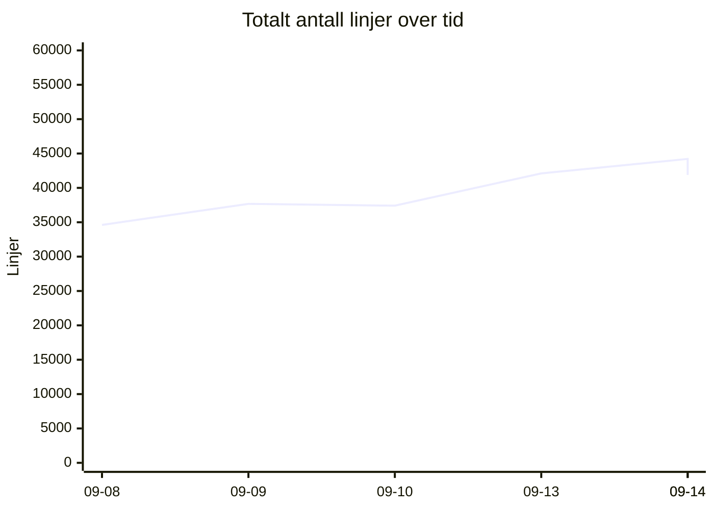
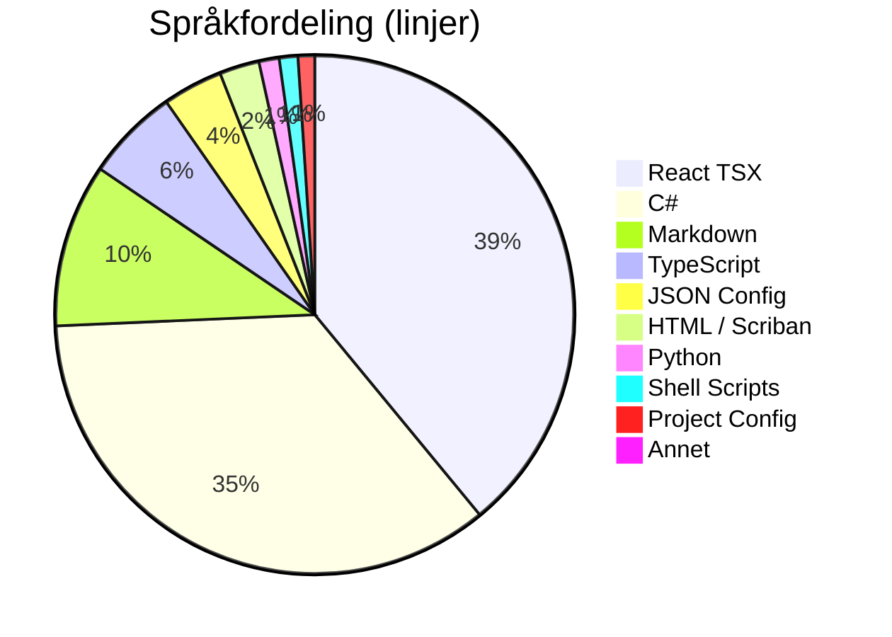
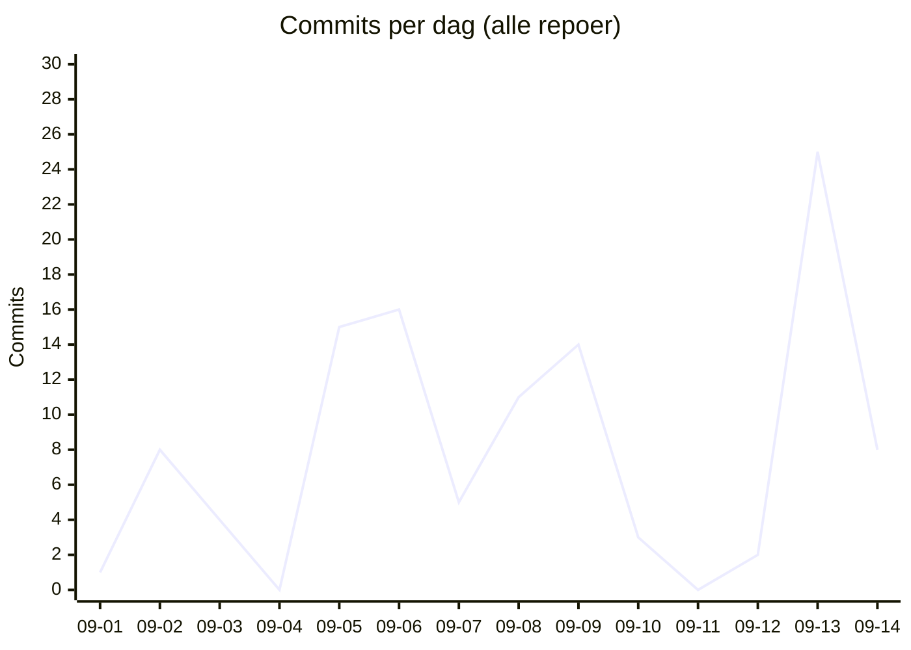

# 📊 Kodelinje-status for Kjøkkenhylla
**Dato:** 2026-09-14 22:42:10  
**Målt 5 av siste 7 dager** 🔥

### 📈 Endring siden forrige måling
* **Filer:** 625 (-28)
* **Ren Kode:** 29105 (+416)
* **Konfigurasjon:** 1974 (-10)
* **Dokumentasjon:** 3487 (-2054)
* **Kommentarer:** 1242 (+81)
* **Totalt (inkl. blanke):** 41880 (-2333)

## 📉 Utvikling over tid
`▁▃▃▆█▆`  (34615 → 41880)

## 🏷️ Overordnet Fordeling
| Hovedkategori | Filer | Innhold/Linjer | Kommentarer | Blank | Totalt |
| :--- | :---: | :---: | :---: | :---: | :---: |
| **Ren Kode** | 521 | 29105 | 1137 | 4676 | 34918 |
| **Konfigurasjon** | 58 | 1974 | 105 | 117 | 2196 |
| **Dokumentasjon** | 46 | 3487 | 0 | 1279 | 4766 |

## 📁 Fordeling per Mikrotjeneste / Prosjekt
| Prosjekt / Mappe | Filer | Ren Kode | Konfigurasjon | Dokumentasjon | Kommentarer | Totalt | Trend |
| :--- | :---: | :---: | :---: | :---: | :---: | :---: | :--- |
| `recipe-auth-api` | 213 | 7037 | 874 | 687 | 342 | 11160 | ▁▁▂▇██ |
| `recipe-core-api` | 21 | 183 | 154 | 50 | 0 | 469 | ▄▄▄▄▄▄ |
| `recipe-gateway-api` | 21 | 251 | 319 | 220 | 30 | 994 | ▁▁▁▇██ |
| `recipe-infrastructure` | 19 | 836 | 140 | 602 | 193 | 2089 | ▄▅▃▃█▁ |
| `recipe-notification-service` | 176 | 5416 | 269 | 685 | 323 | 7961 | ▁▇▇███ |
| `recipe-scraper-service` | 13 | 37 | 131 | 67 | 0 | 290 | ▄▄▄▄▄▄ |
| `recipe-webapp` | 162 | 15345 | 87 | 1176 | 354 | 18917 | ▁▁▁▅██ |
| **TOTALT** | **625** | **29105** | **1974** | **3487** | **1242** | **41880** | |

## 💻 Fordeling per Språk / Filtype
| Språk / Filtype | Kategori | Filer | Linjer | Kommentarer | Blank | Totalt |
| :--- | :--- | :---: | :---: | :---: | :---: | :---: |
| **React TSX** | Ren Kode | 73 | 13357 | 213 | 1245 | 14815 |
| **C#** | Ren Kode | 346 | 12073 | 605 | 2791 | 15469 |
| **Markdown** | Dokumentasjon | 46 | 3487 | 0 | 1279 | 4766 |
| **TypeScript** | Ren Kode | 72 | 1988 | 141 | 338 | 2467 |
| **JSON Config** | Konfigurasjon | 20 | 1281 | 0 | 0 | 1281 |
| **HTML / Scriban** | Ren Kode | 22 | 851 | 39 | 129 | 1019 |
| **Python** | Ren Kode | 1 | 432 | 52 | 100 | 584 |
| **Shell Scripts** | Ren Kode | 5 | 398 | 87 | 73 | 558 |
| **Project Config** | Konfigurasjon | 23 | 355 | 0 | 82 | 437 |
| **YAML Config** | Konfigurasjon | 4 | 172 | 24 | 10 | 206 |
| **Docker Config** | Konfigurasjon | 6 | 121 | 45 | 15 | 181 |
| **Environment Config** | Konfigurasjon | 5 | 45 | 36 | 10 | 91 |
| **SQL Scripts** | Ren Kode | 2 | 6 | 0 | 0 | 6 |

## 🔥 Commit-aktivitet (siste 14 dager, alle repoer)
`▁▃▂▁▅▅▂▄▄▁▁▁█▃`  (112 commits totalt)

