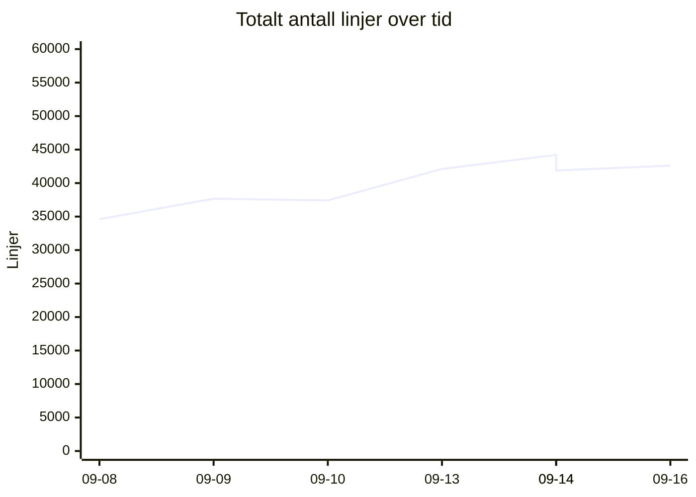
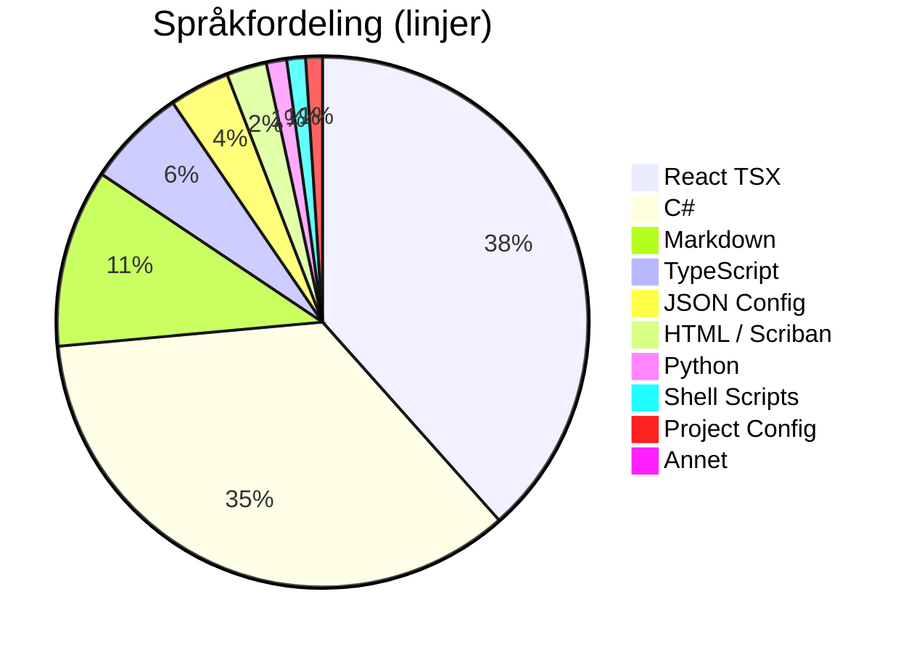
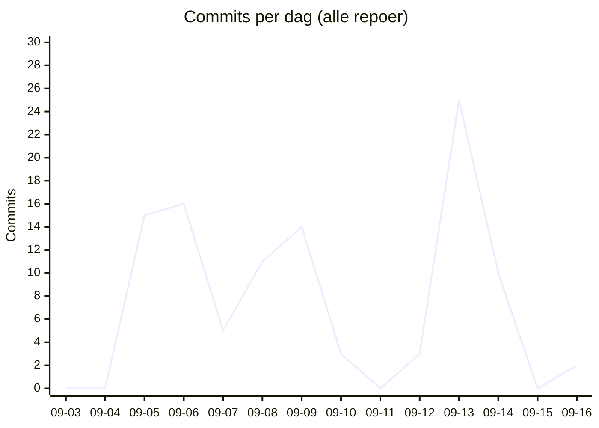

# 📊 Kodelinje-status for Kjøkkenhylla
**Dato:** 2026-09-16 22:58:50  
**Målt 4 av siste 7 dager** 🔥

### 📈 Endring siden forrige måling
* **Filer:** 662 (+37)
* **Ren Kode:** 29411 (+306)
* **Konfigurasjon:** 1974 (+0)
* **Dokumentasjon:** 3780 (+293)
* **Kommentarer:** 1286 (+44)
* **Totalt (inkl. blanke):** 42603 (+723)

## 📉 Utvikling over tid
`▁▃▃▆█▆▆`  (34615 → 42603)

## 🏷️ Overordnet Fordeling
| Hovedkategori | Filer | Innhold/Linjer | Kommentarer | Blank | Totalt |
| :--- | :---: | :---: | :---: | :---: | :---: |
| **Ren Kode** | 554 | 29411 | 1181 | 4712 | 35304 |
| **Konfigurasjon** | 58 | 1974 | 105 | 117 | 2196 |
| **Dokumentasjon** | 50 | 3780 | 0 | 1323 | 5103 |

## 📁 Fordeling per Mikrotjeneste / Prosjekt
| Prosjekt / Mappe | Filer | Ren Kode | Konfigurasjon | Dokumentasjon | Kommentarer | Totalt | Trend |
| :--- | :---: | :---: | :---: | :---: | :---: | :---: | :--- |
| `recipe-auth-api` | 213 | 7037 | 874 | 687 | 342 | 11160 | ▁▁▂▇███ |
| `recipe-core-api` | 39 | 341 | 154 | 159 | 22 | 807 | ▁▁▁▁▁▁█ |
| `recipe-gateway-api` | 21 | 251 | 319 | 220 | 30 | 994 | ▁▁▁▇███ |
| `recipe-infrastructure` | 21 | 836 | 140 | 753 | 193 | 2258 | ▄▅▃▃█▁▁ |
| `recipe-notification-service` | 176 | 5416 | 269 | 685 | 323 | 7961 | ▁▇▇████ |
| `recipe-scraper-service` | 13 | 37 | 131 | 67 | 0 | 290 | ▄▄▄▄▄▄▄ |
| `recipe-webapp` | 179 | 15493 | 87 | 1209 | 376 | 19133 | ▁▁▁▄▆▆█ |
| **TOTALT** | **662** | **29411** | **1974** | **3780** | **1286** | **42603** | |

## 💻 Fordeling per Språk / Filtype
| Språk / Filtype | Kategori | Filer | Linjer | Kommentarer | Blank | Totalt |
| :--- | :--- | :---: | :---: | :---: | :---: | :---: |
| **React TSX** | Ren Kode | 73 | 13379 | 213 | 1245 | 14837 |
| **C#** | Ren Kode | 363 | 12231 | 627 | 2824 | 15682 |
| **Markdown** | Dokumentasjon | 50 | 3780 | 0 | 1323 | 5103 |
| **TypeScript** | Ren Kode | 88 | 2114 | 163 | 341 | 2618 |
| **JSON Config** | Konfigurasjon | 20 | 1281 | 0 | 0 | 1281 |
| **HTML / Scriban** | Ren Kode | 22 | 851 | 39 | 129 | 1019 |
| **Python** | Ren Kode | 1 | 432 | 52 | 100 | 584 |
| **Shell Scripts** | Ren Kode | 5 | 398 | 87 | 73 | 558 |
| **Project Config** | Konfigurasjon | 23 | 355 | 0 | 82 | 437 |
| **YAML Config** | Konfigurasjon | 4 | 172 | 24 | 10 | 206 |
| **Docker Config** | Konfigurasjon | 6 | 121 | 45 | 15 | 181 |
| **Environment Config** | Konfigurasjon | 5 | 45 | 36 | 10 | 91 |
| **SQL Scripts** | Ren Kode | 2 | 6 | 0 | 0 | 6 |

## 🔥 Commit-aktivitet (siste 14 dager, alle repoer)
`▁▁▅▅▂▄▄▁▁▁█▃▁▁`  (104 commits totalt)

