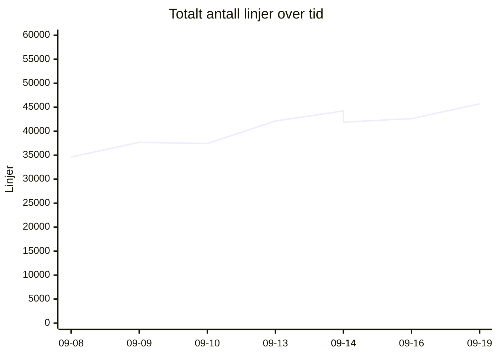
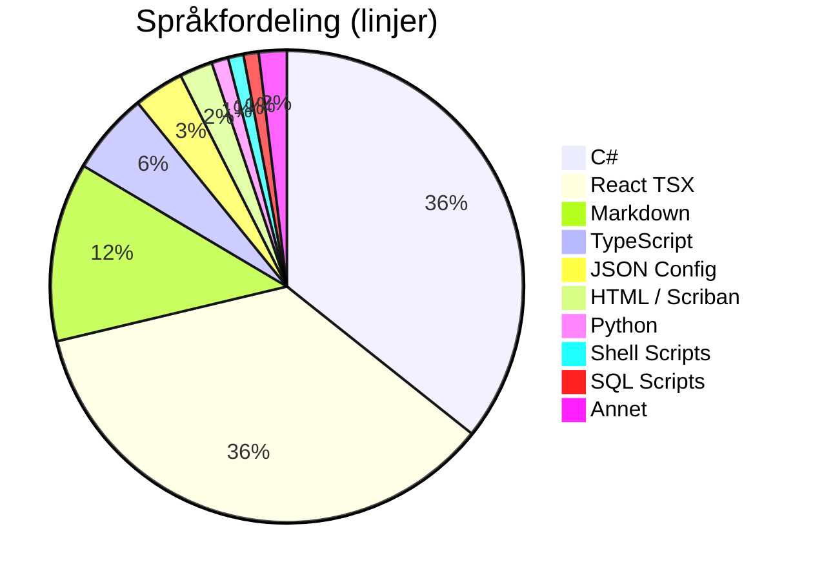
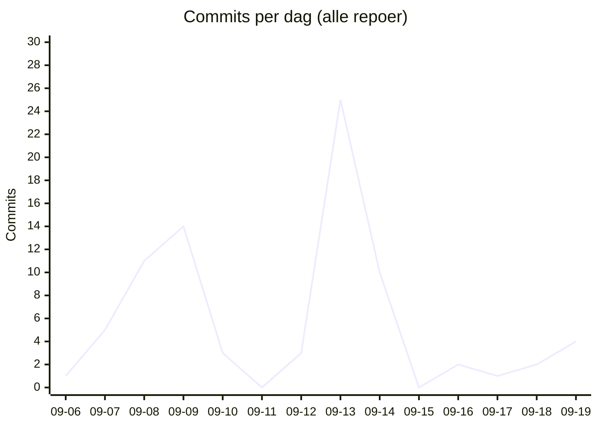

# 📊 Kodelinje-status for Kjøkkenhylla
**Dato:** 2026-09-19 20:32:24  
**Målt 4 av siste 7 dager** 🔥

### 📈 Endring siden forrige måling
* **Filer:** 748 (+86)
* **Ren Kode:** 30995 (+1584)
* **Konfigurasjon:** 2009 (+35)
* **Dokumentasjon:** 4611 (+831)
* **Kommentarer:** 1329 (+43)
* **Totalt (inkl. blanke):** 45695 (+3092)

## 📉 Utvikling over tid
`▁▂▂▅▇▅▆█`  (34615 → 45695)

## 🏷️ Overordnet Fordeling
| Hovedkategori | Filer | Innhold/Linjer | Kommentarer | Blank | Totalt |
| :--- | :---: | :---: | :---: | :---: | :---: |
| **Ren Kode** | 626 | 30995 | 1224 | 5043 | 37262 |
| **Konfigurasjon** | 62 | 2009 | 105 | 122 | 2236 |
| **Dokumentasjon** | 60 | 4611 | 0 | 1586 | 6197 |

## 📁 Fordeling per Mikrotjeneste / Prosjekt
| Prosjekt / Mappe | Filer | Ren Kode | Konfigurasjon | Dokumentasjon | Kommentarer | Totalt | Trend |
| :--- | :---: | :---: | :---: | :---: | :---: | :---: | :--- |
| `recipe-auth-api` | 213 | 7037 | 874 | 687 | 342 | 11160 | ▁▁▂▇████ |
| `recipe-core-api` | 124 | 1925 | 189 | 916 | 65 | 3816 | ▁▁▁▁▁▁▁█ |
| `recipe-gateway-api` | 21 | 251 | 319 | 220 | 30 | 994 | ▁▁▁▇████ |
| `recipe-infrastructure` | 22 | 836 | 140 | 827 | 193 | 2341 | ▄▅▃▃█▁▁▁ |
| `recipe-notification-service` | 176 | 5416 | 269 | 685 | 323 | 7961 | ▁▇▇█████ |
| `recipe-scraper-service` | 13 | 37 | 131 | 67 | 0 | 290 | ▄▄▄▄▄▄▄▄ |
| `recipe-webapp` | 179 | 15493 | 87 | 1209 | 376 | 19133 | ▁▁▁▄▆▆██ |
| **TOTALT** | **748** | **30995** | **2009** | **4611** | **1329** | **45695** | |

## 💻 Fordeling per Språk / Filtype
| Språk / Filtype | Kategori | Filer | Linjer | Kommentarer | Blank | Totalt |
| :--- | :--- | :---: | :---: | :---: | :---: | :---: |
| **C#** | Ren Kode | 433 | 13431 | 670 | 3091 | 17192 |
| **React TSX** | Ren Kode | 73 | 13379 | 213 | 1245 | 14837 |
| **Markdown** | Dokumentasjon | 60 | 4611 | 0 | 1586 | 6197 |
| **TypeScript** | Ren Kode | 88 | 2114 | 163 | 341 | 2618 |
| **JSON Config** | Konfigurasjon | 23 | 1289 | 0 | 0 | 1289 |
| **HTML / Scriban** | Ren Kode | 22 | 851 | 39 | 129 | 1019 |
| **Python** | Ren Kode | 1 | 432 | 52 | 100 | 584 |
| **Shell Scripts** | Ren Kode | 5 | 398 | 87 | 73 | 558 |
| **SQL Scripts** | Ren Kode | 4 | 390 | 0 | 64 | 454 |
| **Project Config** | Konfigurasjon | 24 | 382 | 0 | 87 | 469 |
| **YAML Config** | Konfigurasjon | 4 | 172 | 24 | 10 | 206 |
| **Docker Config** | Konfigurasjon | 6 | 121 | 45 | 15 | 181 |
| **Environment Config** | Konfigurasjon | 5 | 45 | 36 | 10 | 91 |

## 🔥 Commit-aktivitet (siste 14 dager, alle repoer)
`▁▂▄▄▁▁▁█▃▁▁▁▁▂`  (81 commits totalt)

