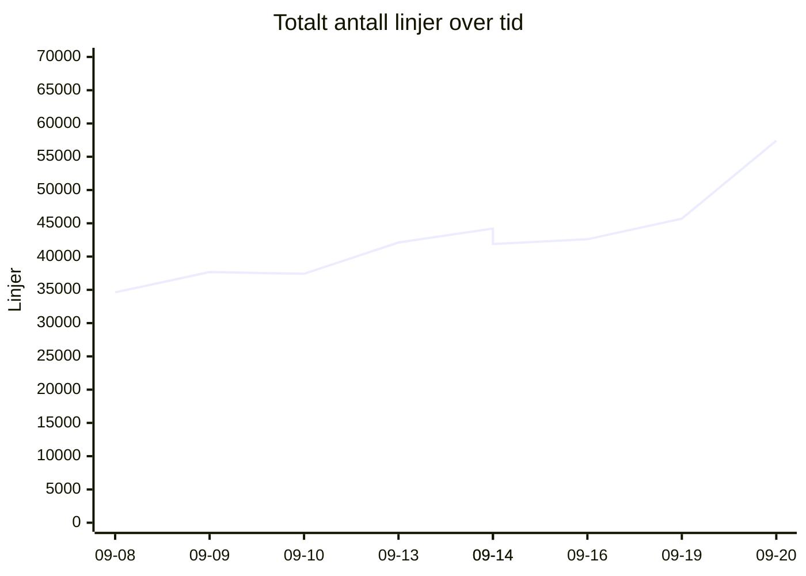
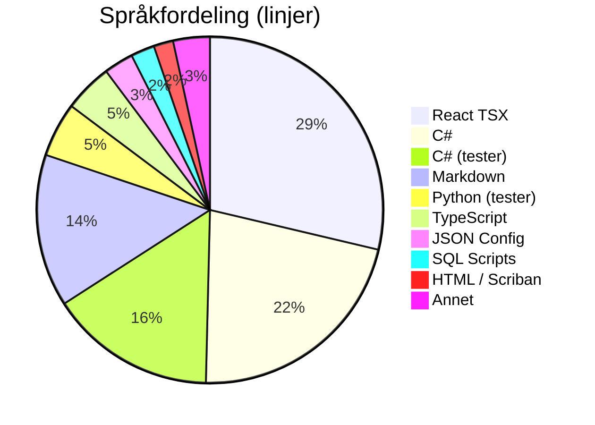
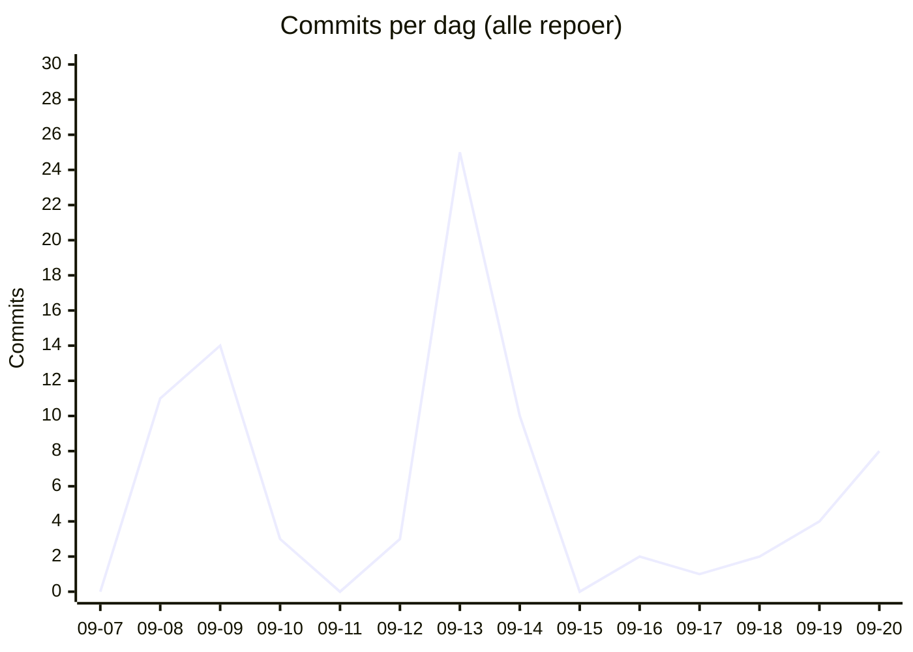

# 📊 Kodelinje-status for Kjøkkenhylla
**Dato:** 2026-09-20 23:12:22  
**Målt 4 av siste 7 dager** 🔥

### 📈 Endring siden forrige måling
* **Filer:** 907 (+159)
* **Ren Kode:** 28341 (-2654)
* **Tester:** 9643 (+0)
* **Konfigurasjon:** 2007 (-2)
* **Dokumentasjon:** 6647 (+2036)
* **Kommentarer:** 1791 (+462)
* **Totalt (inkl. blanke):** 57412 (+11717)

## 📉 Utvikling over tid
`▁▁▁▃▃▃▃▄█`  (34615 → 57412)

## 🏷️ Overordnet Fordeling
| Hovedkategori | Filer | Innhold/Linjer | Kommentarer | Blank | Totalt |
| :--- | :---: | :---: | :---: | :---: | :---: |
| **Ren Kode** | 627 | 28341 | 1086 | 4250 | 33677 |
| **Tester** | 153 | 9643 | 585 | 2563 | 12791 |
| **Konfigurasjon** | 60 | 2007 | 120 | 126 | 2253 |
| **Dokumentasjon** | 67 | 6647 | 0 | 2044 | 8691 |

## 📁 Fordeling per Mikrotjeneste / Prosjekt
| Prosjekt / Mappe | Filer | Ren Kode | Tester | Konfigurasjon | Dokumentasjon | Kommentarer | Totalt | Trend |
| :--- | :---: | :---: | :---: | :---: | :---: | :---: | :---: | :--- |
| `recipe-auth-api` | 213 | 4897 | 2145 | 874 | 689 | 346 | 11172 | ▁▁▂▇▇▇▇▇█ |
| `recipe-core-api` | 245 | 4153 | 2340 | 185 | 1835 | 281 | 10649 | ▁▁▁▁▁▁▁▃█ |
| `recipe-gateway-api` | 21 | 178 | 73 | 319 | 221 | 30 | 992 | ▁▁▁▇████▇ |
| `recipe-infrastructure` | 59 | 852 | 2400 | 142 | 1581 | 435 | 6774 | ▂▃▂▂▄▁▁▁█ |
| `recipe-notification-service` | 176 | 2731 | 2685 | 269 | 685 | 323 | 7961 | ▁▇▇██████ |
| `recipe-scraper-service` | 13 | 37 | 0 | 131 | 67 | 0 | 290 | ▄▄▄▄▄▄▄▄▄ |
| `recipe-webapp` | 180 | 15493 | 0 | 87 | 1569 | 376 | 19574 | ▁▁▁▃▅▅▆▆█ |
| **TOTALT** | **907** | **28341** | **9643** | **2007** | **6647** | **1791** | **57412** | |

## 💻 Fordeling per Språk / Filtype
| Språk / Filtype | Kategori | Filer | Linjer | Kommentarer | Blank | Totalt |
| :--- | :--- | :---: | :---: | :---: | :---: | :---: |
| **React TSX** | Ren Kode | 73 | 13379 | 213 | 1245 | 14837 |
| **C#** | Ren Kode | 432 | 10116 | 522 | 2221 | 12859 |
| **C# (tester)** | Tester | 122 | 7243 | 368 | 1733 | 9344 |
| **Markdown** | Dokumentasjon | 66 | 6644 | 0 | 2044 | 8688 |
| **Python (tester)** | Tester | 30 | 2371 | 206 | 826 | 3403 |
| **TypeScript** | Ren Kode | 88 | 2114 | 163 | 341 | 2618 |
| **JSON Config** | Konfigurasjon | 20 | 1286 | 0 | 0 | 1286 |
| **SQL Scripts** | Ren Kode | 5 | 1035 | 0 | 137 | 1172 |
| **HTML / Scriban** | Ren Kode | 22 | 851 | 39 | 129 | 1019 |
| **Python** | Ren Kode | 1 | 447 | 60 | 104 | 611 |
| **Shell Scripts** | Ren Kode | 6 | 399 | 89 | 73 | 561 |
| **Project Config** | Konfigurasjon | 24 | 381 | 0 | 87 | 468 |
| **YAML Config** | Konfigurasjon | 4 | 172 | 24 | 10 | 206 |
| **Docker Config** | Konfigurasjon | 6 | 121 | 45 | 15 | 181 |
| **Environment Config** | Konfigurasjon | 6 | 47 | 51 | 14 | 112 |
| **Shell Scripts (tester)** | Tester | 1 | 29 | 11 | 4 | 44 |
| **Text Docs** | Dokumentasjon | 1 | 3 | 0 | 0 | 3 |

## 🔥 Commit-aktivitet (siste 14 dager, alle repoer)
`▁▄▄▁▁▁█▃▁▁▁▁▂▃`  (83 commits totalt)

