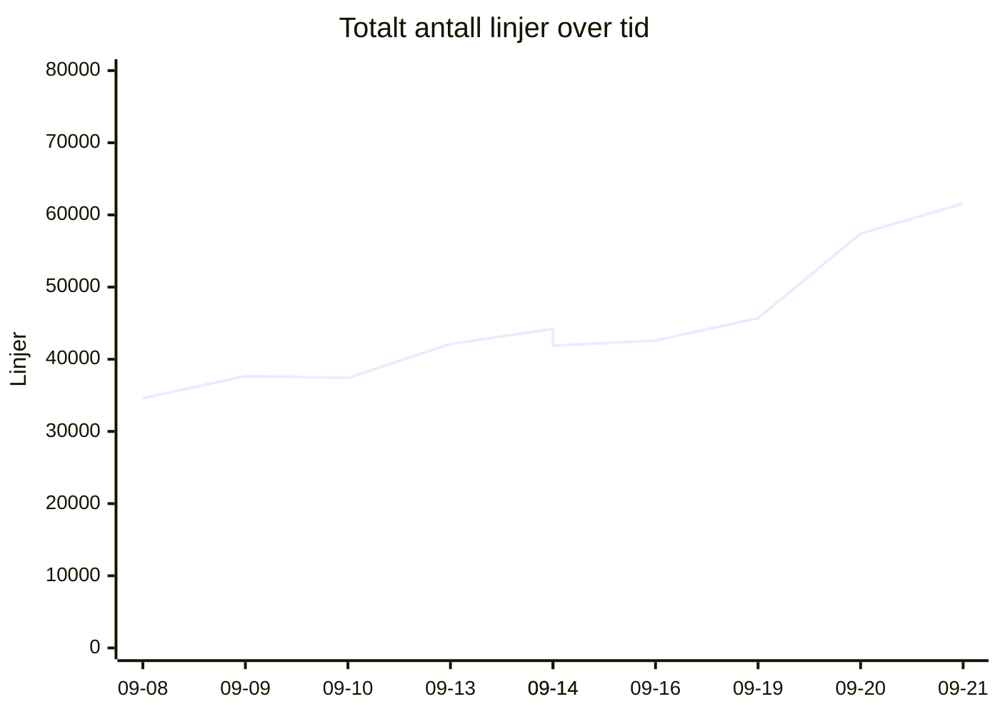
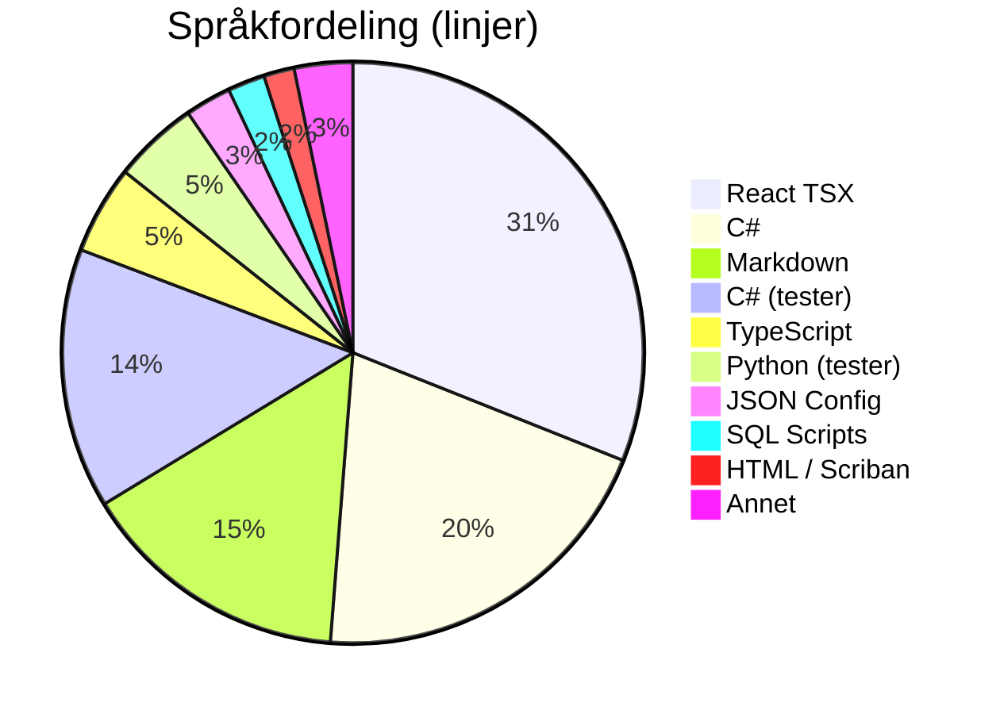
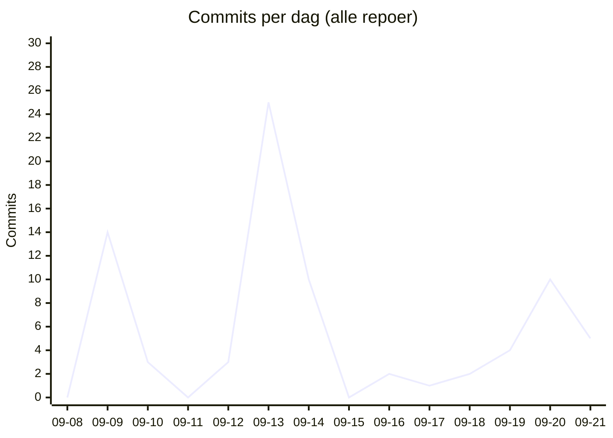

# 📊 Kodelinje-status for Kjøkkenhylla
**Dato:** 2026-09-21 22:40:42  
**Målt 4 av siste 7 dager** 🔥

### 📈 Endring siden forrige måling
* **Filer:** 967 (+60)
* **Ren Kode:** 30884 (+2543)
* **Tester:** 9643 (+0)
* **Konfigurasjon:** 2007 (+0)
* **Dokumentasjon:** 7543 (+896)
* **Kommentarer:** 2091 (+300)
* **Totalt (inkl. blanke):** 61565 (+4153)

## 📉 Utvikling over tid
`▁▁▁▂▃▂▃▃▆█`  (34615 → 61565)

## 🏷️ Overordnet Fordeling
| Hovedkategori | Filer | Innhold/Linjer | Kommentarer | Blank | Totalt |
| :--- | :---: | :---: | :---: | :---: | :---: |
| **Ren Kode** | 684 | 30884 | 1386 | 4466 | 36736 |
| **Tester** | 153 | 9643 | 585 | 2563 | 12791 |
| **Konfigurasjon** | 60 | 2007 | 120 | 126 | 2253 |
| **Dokumentasjon** | 70 | 7543 | 0 | 2242 | 9785 |

## 📁 Fordeling per Mikrotjeneste / Prosjekt
| Prosjekt / Mappe | Filer | Ren Kode | Tester | Konfigurasjon | Dokumentasjon | Kommentarer | Totalt | Trend |
| :--- | :---: | :---: | :---: | :---: | :---: | :---: | :---: | :--- |
| `recipe-auth-api` | 213 | 4897 | 2145 | 874 | 689 | 346 | 11172 | ▁▁▂▇▇▇▇▇██ |
| `recipe-core-api` | 245 | 4153 | 2340 | 185 | 1835 | 281 | 10649 | ▁▁▁▁▁▁▁▃██ |
| `recipe-gateway-api` | 21 | 178 | 73 | 319 | 221 | 30 | 992 | ▁▁▁▇████▇▇ |
| `recipe-infrastructure` | 60 | 852 | 2400 | 142 | 1667 | 435 | 6869 | ▂▃▂▂▄▁▁▁▇█ |
| `recipe-notification-service` | 176 | 2731 | 2685 | 269 | 685 | 323 | 7961 | ▁▇▇███████ |
| `recipe-scraper-service` | 13 | 37 | 0 | 131 | 67 | 0 | 290 | ▄▄▄▄▄▄▄▄▄▄ |
| `recipe-webapp` | 239 | 18036 | 0 | 87 | 2379 | 676 | 23632 | ▁▁▁▁▂▂▂▂▃█ |
| **TOTALT** | **967** | **30884** | **9643** | **2007** | **7543** | **2091** | **61565** | |

## 💻 Fordeling per Språk / Filtype
| Språk / Filtype | Kategori | Filer | Linjer | Kommentarer | Blank | Totalt |
| :--- | :--- | :---: | :---: | :---: | :---: | :---: |
| **React TSX** | Ren Kode | 88 | 15543 | 309 | 1421 | 17273 |
| **C#** | Ren Kode | 432 | 10116 | 522 | 2221 | 12859 |
| **Markdown** | Dokumentasjon | 69 | 7540 | 0 | 2242 | 9782 |
| **C# (tester)** | Tester | 122 | 7243 | 368 | 1733 | 9344 |
| **TypeScript** | Ren Kode | 129 | 2464 | 355 | 378 | 3197 |
| **Python (tester)** | Tester | 30 | 2371 | 206 | 826 | 3403 |
| **JSON Config** | Konfigurasjon | 20 | 1286 | 0 | 0 | 1286 |
| **SQL Scripts** | Ren Kode | 5 | 1035 | 0 | 137 | 1172 |
| **HTML / Scriban** | Ren Kode | 22 | 851 | 39 | 129 | 1019 |
| **Python** | Ren Kode | 1 | 447 | 60 | 104 | 611 |
| **Shell Scripts** | Ren Kode | 6 | 399 | 89 | 73 | 561 |
| **Project Config** | Konfigurasjon | 24 | 381 | 0 | 87 | 468 |
| **YAML Config** | Konfigurasjon | 4 | 172 | 24 | 10 | 206 |
| **Docker Config** | Konfigurasjon | 6 | 121 | 45 | 15 | 181 |
| **Environment Config** | Konfigurasjon | 6 | 47 | 51 | 14 | 112 |
| **Shell Scripts (tester)** | Tester | 1 | 29 | 11 | 4 | 44 |
| **CSS / SCSS** | Ren Kode | 1 | 29 | 12 | 3 | 44 |
| **Text Docs** | Dokumentasjon | 1 | 3 | 0 | 0 | 3 |

## 🔥 Commit-aktivitet (siste 14 dager, alle repoer)
`▁▄▁▁▁█▃▁▁▁▁▂▃▂`  (79 commits totalt)

