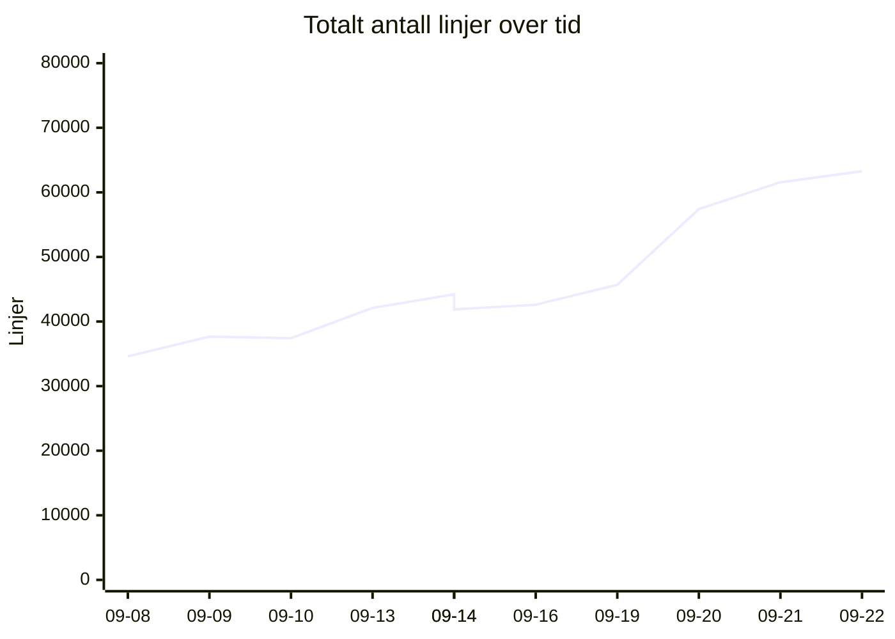
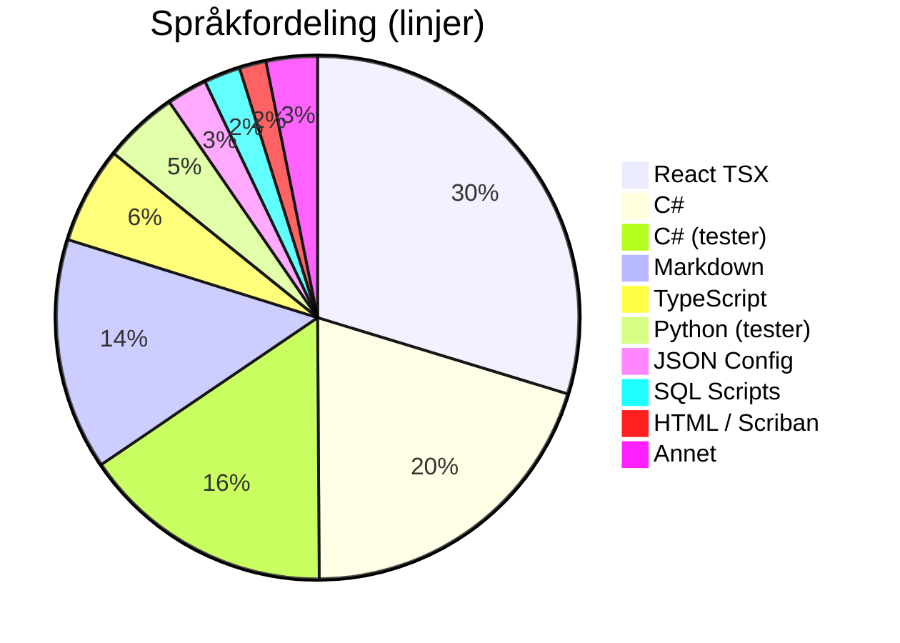
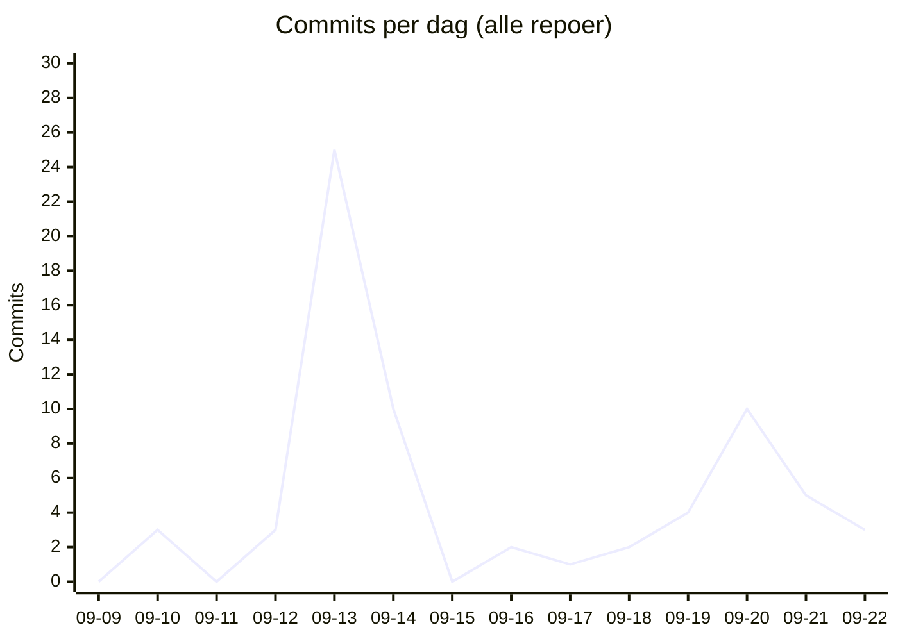

# 📊 Kodelinje-status for Kjøkkenhylla
**Dato:** 2026-09-22 22:56:08  
**Målt 5 av siste 7 dager** 🔥

### 📈 Endring siden forrige måling
* **Filer:** 999 (+32)
* **Ren Kode:** 31578 (+694)
* **Tester:** 10414 (+771)
* **Konfigurasjon:** 2007 (+0)
* **Dokumentasjon:** 7354 (-189)
* **Kommentarer:** 2299 (+208)
* **Totalt (inkl. blanke):** 63272 (+1707)

## 📉 Utvikling over tid
`▁▁▁▂▃▂▂▃▆▇█`  (34615 → 63272)

## 🏷️ Overordnet Fordeling
| Hovedkategori | Filer | Innhold/Linjer | Kommentarer | Blank | Totalt |
| :--- | :---: | :---: | :---: | :---: | :---: |
| **Ren Kode** | 715 | 31578 | 1579 | 4602 | 37759 |
| **Tester** | 155 | 10414 | 600 | 2723 | 13737 |
| **Konfigurasjon** | 60 | 2007 | 120 | 126 | 2253 |
| **Dokumentasjon** | 69 | 7354 | 0 | 2169 | 9523 |

## 📁 Fordeling per Mikrotjeneste / Prosjekt
| Prosjekt / Mappe | Filer | Ren Kode | Tester | Konfigurasjon | Dokumentasjon | Kommentarer | Totalt | Trend |
| :--- | :---: | :---: | :---: | :---: | :---: | :---: | :---: | :--- |
| `recipe-auth-api` | 213 | 4897 | 2145 | 874 | 689 | 346 | 11172 | ▁▁▂▇▇▇▇▇███ |
| `recipe-core-api` | 248 | 4530 | 3111 | 185 | 1374 | 347 | 11511 | ▁▁▁▁▁▁▁▃▇▇█ |
| `recipe-gateway-api` | 21 | 178 | 73 | 319 | 221 | 30 | 992 | ▁▁▁▇████▇▇▇ |
| `recipe-infrastructure` | 61 | 852 | 2400 | 142 | 1749 | 435 | 6960 | ▂▃▂▂▄▁▁▁▇▇█ |
| `recipe-notification-service` | 176 | 2731 | 2685 | 269 | 685 | 323 | 7961 | ▁▇▇████████ |
| `recipe-scraper-service` | 13 | 37 | 0 | 131 | 67 | 0 | 290 | ▄▄▄▄▄▄▄▄▄▄▄ |
| `recipe-webapp` | 267 | 18353 | 0 | 87 | 2569 | 818 | 24386 | ▁▁▁▁▂▂▂▂▂▇█ |
| **TOTALT** | **999** | **31578** | **10414** | **2007** | **7354** | **2299** | **63272** | |

## 💻 Fordeling per Språk / Filtype
| Språk / Filtype | Kategori | Filer | Linjer | Kommentarer | Blank | Totalt |
| :--- | :--- | :---: | :---: | :---: | :---: | :---: |
| **React TSX** | Ren Kode | 98 | 15256 | 331 | 1383 | 16970 |
| **C#** | Ren Kode | 435 | 10370 | 573 | 2278 | 13221 |
| **C# (tester)** | Tester | 124 | 8014 | 383 | 1893 | 10290 |
| **Markdown** | Dokumentasjon | 68 | 7351 | 0 | 2169 | 9520 |
| **TypeScript** | Ren Kode | 147 | 3068 | 475 | 495 | 4038 |
| **Python (tester)** | Tester | 30 | 2371 | 206 | 826 | 3403 |
| **JSON Config** | Konfigurasjon | 20 | 1286 | 0 | 0 | 1286 |
| **SQL Scripts** | Ren Kode | 5 | 1158 | 0 | 137 | 1295 |
| **HTML / Scriban** | Ren Kode | 22 | 851 | 39 | 129 | 1019 |
| **Python** | Ren Kode | 1 | 447 | 60 | 104 | 611 |
| **Shell Scripts** | Ren Kode | 6 | 399 | 89 | 73 | 561 |
| **Project Config** | Konfigurasjon | 24 | 381 | 0 | 87 | 468 |
| **YAML Config** | Konfigurasjon | 4 | 172 | 24 | 10 | 206 |
| **Docker Config** | Konfigurasjon | 6 | 121 | 45 | 15 | 181 |
| **Environment Config** | Konfigurasjon | 6 | 47 | 51 | 14 | 112 |
| **Shell Scripts (tester)** | Tester | 1 | 29 | 11 | 4 | 44 |
| **CSS / SCSS** | Ren Kode | 1 | 29 | 12 | 3 | 44 |
| **Text Docs** | Dokumentasjon | 1 | 3 | 0 | 0 | 3 |

## 🔥 Commit-aktivitet (siste 14 dager, alle repoer)
`▁▁▁▁█▃▁▁▁▁▂▃▂▁`  (68 commits totalt)

