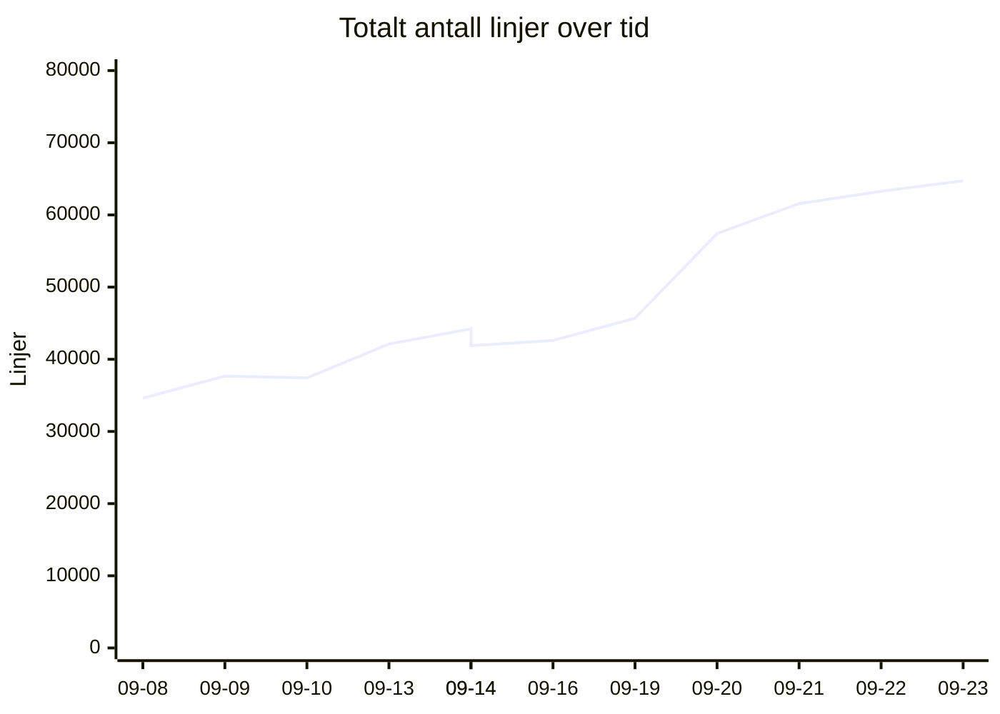
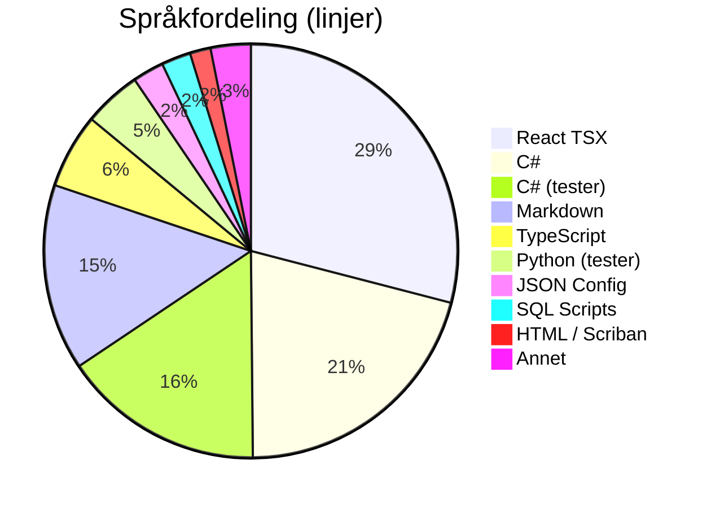
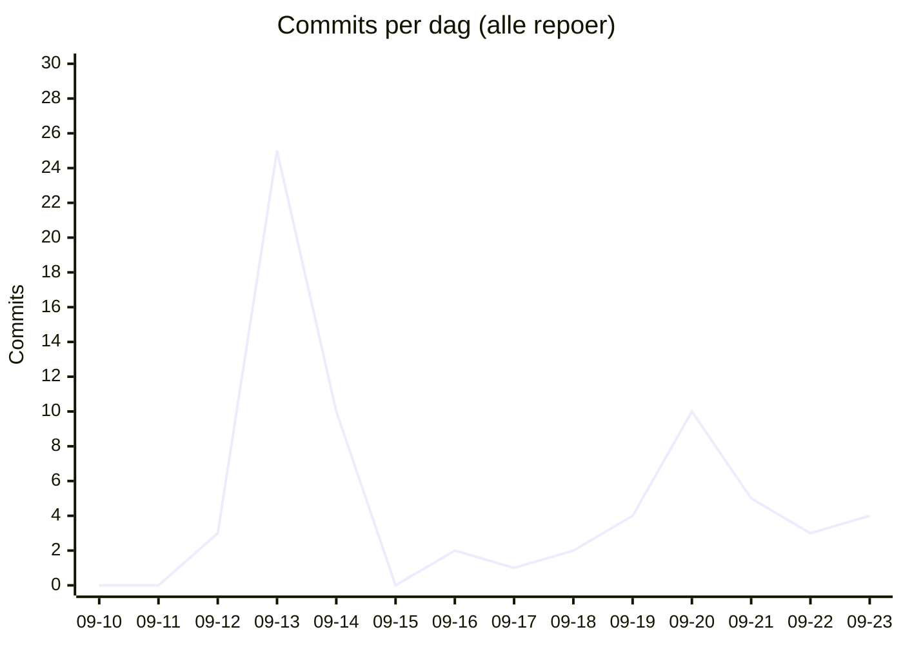

# 📊 Kodelinje-status for Kjøkkenhylla
**Dato:** 2026-09-23 22:20:50  
**Målt 5 av siste 7 dager** 🔥

### 📈 Endring siden forrige måling
* **Filer:** 1029 (+30)
* **Ren Kode:** 32191 (+613)
* **Tester:** 10678 (+264)
* **Konfigurasjon:** 2027 (+20)
* **Dokumentasjon:** 7647 (+293)
* **Kommentarer:** 2345 (+46)
* **Totalt (inkl. blanke):** 64723 (+1451)

## 📉 Utvikling over tid
`▁▁▁▂▃▂▂▃▆▇▇█`  (34615 → 64723)

## 🏷️ Overordnet Fordeling
| Hovedkategori | Filer | Innhold/Linjer | Kommentarer | Blank | Totalt |
| :--- | :---: | :---: | :---: | :---: | :---: |
| **Ren Kode** | 735 | 32191 | 1624 | 4709 | 38524 |
| **Tester** | 161 | 10678 | 601 | 2785 | 14064 |
| **Konfigurasjon** | 61 | 2027 | 120 | 130 | 2277 |
| **Dokumentasjon** | 72 | 7647 | 0 | 2211 | 9858 |

## 📁 Fordeling per Mikrotjeneste / Prosjekt
| Prosjekt / Mappe | Filer | Ren Kode | Tester | Konfigurasjon | Dokumentasjon | Kommentarer | Totalt | Trend |
| :--- | :---: | :---: | :---: | :---: | :---: | :---: | :---: | :--- |
| `Root` | 2 | 0 | 0 | 0 | 114 | 0 | 127 | - |
| `recipe-auth-api` | 213 | 4897 | 2145 | 874 | 689 | 346 | 11172 | ▁▁▂▇▇▇▇▇████ |
| `recipe-core-api` | 275 | 5143 | 3375 | 205 | 1472 | 393 | 12745 | ▁▁▁▁▁▁▁▂▆▆▇█ |
| `recipe-gateway-api` | 21 | 178 | 73 | 319 | 221 | 30 | 992 | ▁▁▁▇████▇▇▇▇ |
| `recipe-infrastructure` | 62 | 852 | 2400 | 142 | 1830 | 435 | 7050 | ▂▃▂▂▄▁▁▁▇▇▇█ |
| `recipe-notification-service` | 176 | 2731 | 2685 | 269 | 685 | 323 | 7961 | ▁▇▇█████████ |
| `recipe-scraper-service` | 13 | 37 | 0 | 131 | 67 | 0 | 290 | ▄▄▄▄▄▄▄▄▄▄▄▄ |
| `recipe-webapp` | 267 | 18353 | 0 | 87 | 2569 | 818 | 24386 | ▁▁▁▁▂▂▂▂▂▇██ |
| **TOTALT** | **1029** | **32191** | **10678** | **2027** | **7647** | **2345** | **64723** | |

## 💻 Fordeling per Språk / Filtype
| Språk / Filtype | Kategori | Filer | Linjer | Kommentarer | Blank | Totalt |
| :--- | :--- | :---: | :---: | :---: | :---: | :---: |
| **React TSX** | Ren Kode | 98 | 15256 | 331 | 1383 | 16970 |
| **C#** | Ren Kode | 455 | 10937 | 618 | 2383 | 13938 |
| **C# (tester)** | Tester | 130 | 8278 | 384 | 1955 | 10617 |
| **Markdown** | Dokumentasjon | 71 | 7644 | 0 | 2211 | 9855 |
| **TypeScript** | Ren Kode | 147 | 3068 | 475 | 495 | 4038 |
| **Python (tester)** | Tester | 30 | 2371 | 206 | 826 | 3403 |
| **JSON Config** | Konfigurasjon | 20 | 1286 | 0 | 0 | 1286 |
| **SQL Scripts** | Ren Kode | 5 | 1204 | 0 | 139 | 1343 |
| **HTML / Scriban** | Ren Kode | 22 | 851 | 39 | 129 | 1019 |
| **Python** | Ren Kode | 1 | 447 | 60 | 104 | 611 |
| **Project Config** | Konfigurasjon | 25 | 401 | 0 | 91 | 492 |
| **Shell Scripts** | Ren Kode | 6 | 399 | 89 | 73 | 561 |
| **YAML Config** | Konfigurasjon | 4 | 172 | 24 | 10 | 206 |
| **Docker Config** | Konfigurasjon | 6 | 121 | 45 | 15 | 181 |
| **Environment Config** | Konfigurasjon | 6 | 47 | 51 | 14 | 112 |
| **Shell Scripts (tester)** | Tester | 1 | 29 | 11 | 4 | 44 |
| **CSS / SCSS** | Ren Kode | 1 | 29 | 12 | 3 | 44 |
| **Text Docs** | Dokumentasjon | 1 | 3 | 0 | 0 | 3 |

## 🔥 Commit-aktivitet (siste 14 dager, alle repoer)
`▁▁▁█▃▁▁▁▁▂▃▂▁▂`  (69 commits totalt)

